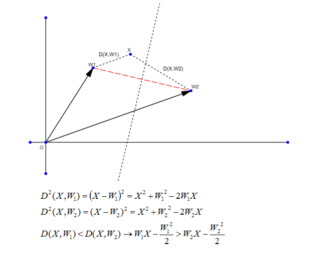
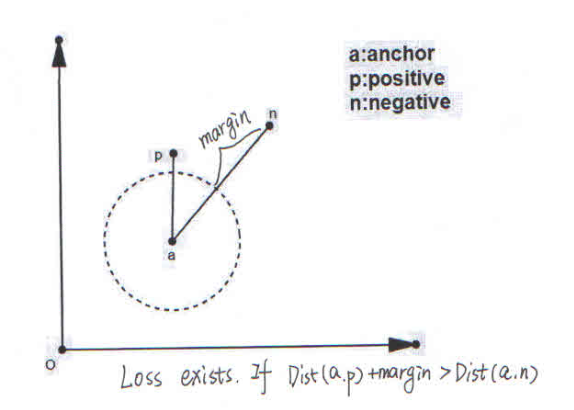

# foreword
In my first Repository:
[Details-On-Face-Recoginiton](https://github.com/KaleidoZhouYN/Details-on-Face-Recognition)
I gived an easy way to train sphereface on pretty Large dataset(MS-Celeb-1M).

While responsing Issule I realized that Face Recognition is not a very friendly project for beginners,so in this repository I want to share some experience on Loss Function,which is very hot on recent research.

It's has only been 4 months that I began to learn deep learning and solve the Face Recognition Project.So if you find something wrong in my understanding,please e-mail me or Open an Issue,thanks.

# before loss function

why classification layer use dot product?

Do linear classification:

# various kinds of loss function

## softmax
we all know softmax is a classical loss function for classification,which is based on log-likelihood.

weither you train CASIA-WebFace or Ms-Celeb-1M using softmax,you may easily get an classification accuracy of 1.

But why softmax didn't seem to work good on LFW?

There are two reason:

&emsp;1.Face Recognition is not a classification question,it's a Feature-Extraction question.We want to make that similarity between the same person is larger that the similarity between different persons.The similirity between twins is very high but they are different person.

&emsp;2.softmax is based on log-likelihood,so it learns the distribution of the trainning dataset.If you want softmax to work good on test dataset.You may need a pretty huge trainning dataset.It is clearly that softmax on Ms-Celeb-1M is much better than on CASIA-Webface.

Example:

## contrastive loss & triplet loss

### contrastive loss
contrasitve_loss is to randomly choose two sample from training dataset.If they are belong to the same class,let them get closer;otherwise let then get farther.

contastive loss should be used with softmax.

 

### triplet loss

triplet loss want to achieve a simple goal:

Dist(a,p)+margin<Dist(a,n)

there are three conditions while reaching this goal:

condition1:

&ensp; Dist(a,p)+margin<Dist(a,n),Loss == 0,nothing need to be change.

condition2:

&ensp; Dist(a,p)+margin>Dist(a,n),Loss <> 0.a&p should get closer,a&n should get farther.

condition3:

&ensp; Dist(a,p)>Dist(a,n),Loss == 0 again.triple_loss consider this as a hard sample.

triplet loss is helpful combine with softmax:

But if you think deeper,you'll find that triplet_loss is really not a good loss function.2 reasons:

&ensp; 1.Ignore hard sample,which is not friendly to small trainning set.

&ensp; 2.Loss didn't exist in condition1,which is opposed to the log-likelihood,and this point is unbearable to me.

# Center Loss

# A-softmax Loss

# ====================================================================================

# 中文版
#### 因为英文水平太差难以将思想表达出来，所以还是先写一个中文版
# 前言
在我的第一个responsity里面，我给出了一种能在大数据集上相对简单的训练sphereface的方法，在issue里面我发现很多人对sphereface的一些现象不理解，我发现face recognition对于初学者来说其实还是比较困难的。所以我打算写一个关于Face Recognition里面关于loss function的一些东西，因为本人是一个非科班出身且仅仅研究了4个月人脸识别的菜鸟，所以说的不对的地方希望大家开issue来使劲喷我（。

# 分类层
首先说一点关于分类层的一些基础的东西，因为在人脸中，人脸对比的评测目前大多是用余弦相似度来完成的。但是分类层的时候计算的却不是余弦相似度，而是点乘，这一点其实是由线性分类推到而来的，见下图：

其中W表示类中心，X表示样本。

基于分类时与评测时的距离计算方式不同，从而引出了一些关于cosine classification layer以及normface等一系列的论文，感兴趣可以自行查看。

# Loss Function

下面介绍一下几种比较有意义的loss function，这几种loss function极大的推动了face recogniton的进程。

## softmax
### 优点
softmax的话大家应该都比较熟悉，作为分类中一种经典的loss function，从分类的prob以及log-likelihood推导而来，其优美的形式保证了反向求导的导数计算的简洁性以及导数处于[-1,1]这样一个区间。

由于softmax是完全基于data distribution的一种产物，所以在大训练集上表现的尤为出色，应该能说是ImageNet时代应运而生的一个完美产物。
### 缺点
虽然softmax的形式非常优美，但是应用在face recognition上却存在着极大的问题，因为face recognition并不是一个分类问题，而是一个特征提取问题。在人脸比对上是要求余弦相似度的，于是就可能产生下面的情况：

上图中,W1和W2表示类中心，虚线表示分类的分界线，X1和X2分别为类1和类2的样本，可以看到在softmax情况下这两个样本都是成功分类的，但是你会发现这两个样本之间的余弦相似度却很高，这在小训练集（比如CASIA-webface）上非常常见。

## Contrastive loss & Triplet loss
经过了softmax的缺点人们终于发现，face recognition想要做的不仅仅是一个分类问题，同时是一个聚类问题。因为直接做分类与聚类很难收敛，所以一般都是先保证分类正确，然后进行聚类。这样就引发了一系列关于metric learning的东西。
### Contrasitve loss
对比损失，思想与实现都非常简单，我这里也不放loss function的形式了，直接上一张图：

一句简单的话表示就是：两个同类样本尽量接近，两个不同类样本尽量远离，各自的权重都是线性的。

### Triplet loss
triplet loss是一个很有趣的loss，与contrastive loss相比，不再是简单的接近远离，而是有了一个明确的目标：

anchor与positive之间的距离一定要小于anchor与negative之间的距离，而且不是简单的小于，是加了margin之后的小于。

具体可以分为下面三种情况：

condition1：Dist(a,p) + margin < Dist(a,n)

condition2:Dist(a,p) + margin > Dist(a,n)

condition3:Dist(a,p) > Dist(a,n)

仔细描述一下：

第一种情况已经满足我们的goal了，所以我们不打算做优化

第二种情况是作者想要主要优化的情况，因为还未满足goal

第三种情况是作者想要直接放弃的情况，因为与goal相差太多，直接当做outlier放弃

与此同时，作者还进行了一些排序操作来进行困难样本处理，这一点就不细说了，想了解的话可以查看github上已经实现好了的triplet loss代码。

#### 缺点
虽然triplet loss做了很多的工作，但是我更愿意把它看成是一个超大数据训练集下的无奈之举。

正如某人所说的，double（contrastive）不如triple，triple不如分类。

这种不基于数据分布的聚类方式（condition1的情况）让其在我心中大打折扣。

## Center loss

## A-softmax loss

