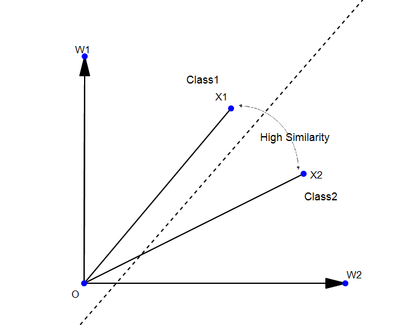
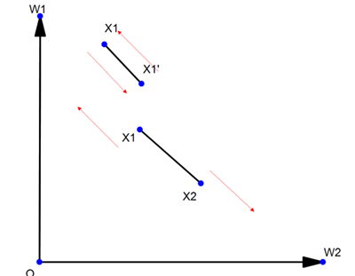
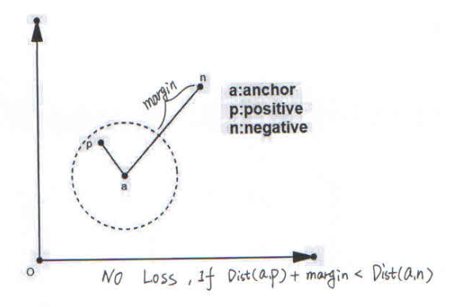

# foreword
In my first Repository:
[Details-On-Face-Recoginiton](https://github.com/KaleidoZhouYN/Details-on-Face-Recognition)
I gived an easy way to train sphereface on pretty Large dataset(MS-Celeb-1M).

While responsing Issule I realized that Face Recognition is not a very friendly project for beginners,so in this repository I want to share some experience on Loss Function,which is very hot on recent research.

It's has only been 4 months that I began to learn deep learning and solve the Face Recognition Project.So if you find something wrong in my understanding,please e-mail me or Open an Issue,thanks.

# before loss function

why classification layer use dot production?

Do linear classification:

# various kinds of loss function

## softmax
we all know softmax is a classical loss function for classification,which is based on log-likelihood.

weither you train CASIA-WebFace or Ms-Celeb-1M using softmax,you may easily get an classification accuracy of 1.

But why softmax didn't seem to work good on LFW?

There are two reason:

&emsp;1.Face Recognition is not a classification question,it's a Feature-Extraction question.We want to make that similarity between the same person is larger that the similarity between different persons.The similirity between twins is very high but they are different person.

&emsp;2.softmax is based on log-likelihood,so it learns the distribution of the trainning dataset.If you want softmax to work good on test dataset.You may need a pretty huge trainning dataset.It is clearly that softmax on Ms-Celeb-1M is much better than on CASIA-Webface.

Example:

## contrastive loss & triplet loss

### contrastive loss
contrasitve_loss is to randomly choose two sample from training dataset.If they are belong to the same class,let them get closer;otherwise let then get farther.

contastive loss should be used with softmax.

 

### triplet loss

triplet loss want to achieve a simple goal:

Dist(a,p)+margin<Dist(a,n)

there are three conditions while reaching this goal:

condition1:Dist(a,p)+margin<Dist(a,n),Loss == 0,nothing need to be change.

condition2:Dist(a,p)+margin>Dist(a,n),Loss <> 0.a&p should get closer,a&n should get farther.

condition3:Dist(a,p)>Dist(a,n),Loss == 0 again.triple_loss consider this as a hard sample.

triplet loss is helpful combine with softmax:

But if you think deeper,you'll find that triplet_loss is really not a good loss function.2 reasons:

&ensp; 1.Ignore hard sample,which is not friendly to small trainning set.

&ensp; 2.Loss didn't exist in condition1,which is opposed to the log-likelihood,and this point is unbearable to me.

